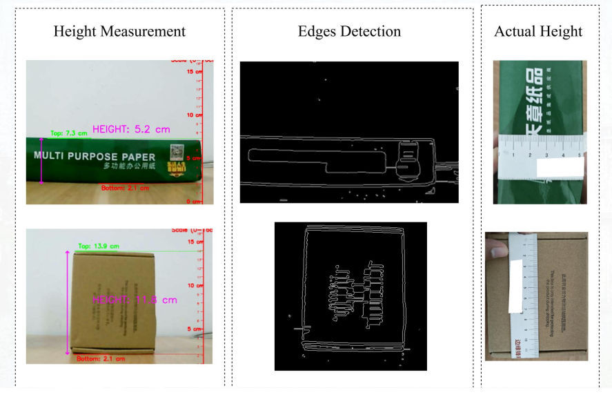

# HightDetection


# Accurately Measuring The Height Of The Train Surafce

## Several approaches:
- camera or webcam
- LiDAR or depth sensors (like Intel RealSense)
- Ultrasonic sensors
## Chosen approach is using Camera Calibration
1.	OpenCV to correct for lens distortion
2.	A reference object of known dimensions to establish scale.

### Requiremets
- python version 3.8.20(conda activate myenv)(`conda create --name my_Obj_Height python=3.8.20`)
- `pip install -r requirements.txt`

- Check for camera devices for linux users:
    - ` ls -l /dev/video* `
    -    ```v4l2-ctl --list-devices```
    - ```v4l2-ctl --device=/dev/videoX --all```
    - `fswebcam -d /dev/video1 test.jpg` -- camera check
    - Note:[if virtual os like linux please ensure your camera is working either install `virtual extension_pack`]remember to give permission to access the camera `sudo usermod -a -G video zahid`
# Final folder contain the final product
- req_opencv.txt install is enough for running the height detection
- First ensure the actual hight of the object using a physical scale then 
- Then put the object away from the camera and resize your screen scale until matching the height you've measured
- Then remember the distance everytime you put an object in same location you can get the actual height of the  object
# Output
